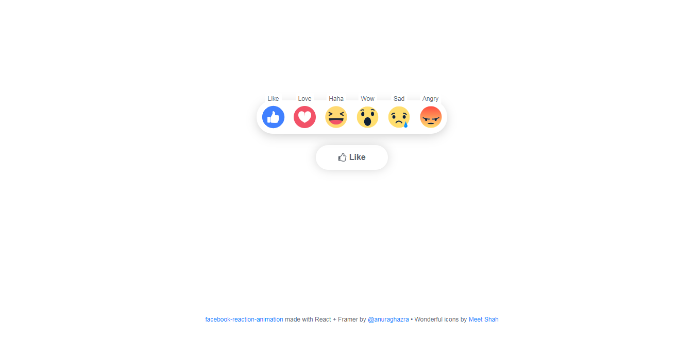

## Facebook Reaction Animation

Facebook Reaction Animation made with React and FramerMotion.

**demo:** https://anuraghazra.github.io/facebook-reaction-animation



### :wrench: Tools Used
- [React](http://reactjs.org/)
- [Framer Motion](https://www.framer.com/motion/)
- [Styled Components](https://www.styled-components.com/)


## :v: Contributing
Great!, 
after cloning & setting up the local project you can push the changes to your github fork and make a pull request.

-----

**local development**

### Step 1: Clone The Repo

Fork the repository. then clone the repo locally by doing -

```bash
git clone https://github.com/anuraghazra/facebook-reaction-animation.git
```

### Step 2: Install Dependencies

cd into the directory

```bash
cd facebook-reaction-animation
```

install all the dependencies
```bash
npm install
```

### Step 3: Start Development Server

Then start the development Server
```
npm start
```
After running the development server the site should be running on https://localhost:3000


Give the project a :star: if you liked it.
Made with :heart: and React.
